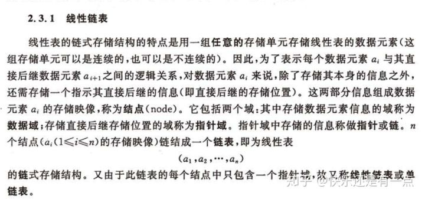
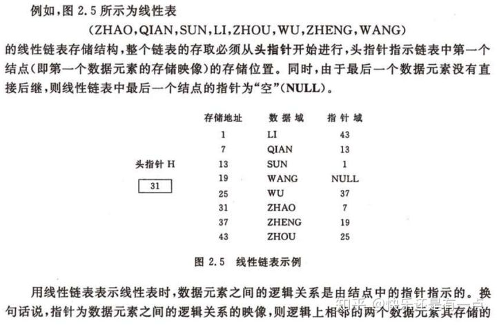
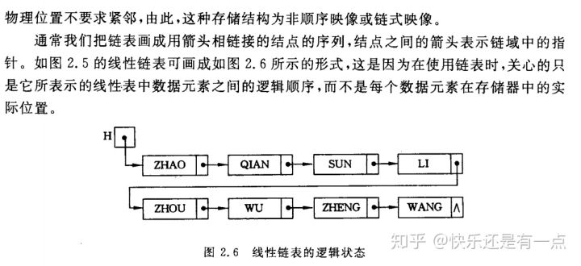

# 【我有一个链表想跟你谈谈~】- JS中的算法与数据结构-链表(Linked-list)


### 什么是链表

如封面 ^_^

详细点解释的话。。那不如抄书吧

惯例，抄书交给截图 -。-







> 图片截取自[数据结构(C语言版)].严蔚敏_吴伟民 

### 实现一个链表

```js
//节点类
class LinkedListNode {
    constructor(data){
        this.data = data
        this.next = null
    }
}
//链表类
const head = Symbol("head")
class LinkedList {
    constructor(){
        this[head] = null
    }
    //增加节点
    add(data){
        const newNode = new LinkedListNode(data)
        if (this[head] === null) {
            this[head] = newNode
        } else {
            let current = this[head]
            while(current.next){
                current = current.next
            }
            current.next = newNode
        }
    }
    //查找当前节点
    findAt(index){
        if (index > -1) {
            let current = this[head]
            let i = 0
            while(current !== null){
                if(i === index){
                    return current
                }
                current = current.next
                i++
            }
        } else {
            return undefined
        }
    }
    find(data){
        let current = this[head]
        while((current !== null) && (current.data !== data)){
            current = current.next
        }
        return current === null ? undefined : current
    }
    //查找前一个节点
    findPrevAt(index){
        if(index < 1){
            return undefined
        }
        let current = this[head]
        let previous = null
        let i = 0
        while(current !== null){
            if(i === index){
                return previous
            }
            previous = current
            current = current.next
            i++
        }
        return undefined
    }
    findPrev(data){
        let current = this[head]
        let previous = null
        while(current !== null){
            if(current.data === data){
                return previous === null ? undefined : previous
            }
            previous = current
            current = current.next
        }
        return undefined
    }
    //删除节点
    removeAt(index){
        //边界
        if(this[head] === null || index < 0){
            console.error('节点不存在')
            return undefined
        }
        //第一个节点
        if(index === 0){
            const node = this[head]
            this[head] = this[head].next
            return node
        }
        const current = this.findAt(index)
        const previous = this.findPrevAt(index)
        //未找到节点
        if(current === undefined){
            console.error('节点不存在')
            return undefined
        }
        //最后一个节点
        if(current.next === null){
            previous.next = null
            return current
        }
        //中间节点
        previous.next = current.next
        return current
    }
    remove(data){
        //边界
        if(this[head] === null){
            console.error('节点不存在')
            return undefined
        }
        const current = this.find(data)
        const previous = this.findPrev(data)
        //节点未找到
        if(current === undefined){
            console.error('节点不存在')
            return undefined
        }
        //第一个节点
        if(previous === undefined){
            const node = this[head]
            this[head] = this[head].next
            return node
        }
        //最后一个节点
        if(current.next === null){
            previous.next = null
            return current
        }
        //中间节点
        previous.next = current.next
        return current
    }
    //插入节点
    insertAt(node, index){
        //在前面插入
        if(index < 0){
            const current = this[head]
            this[head] = new LinkedListNode(node)
            this[head].next = current
            return
        }
        let current = this.findAt(index)
        if(current === undefined){
            console.error('节点不存在')
            return undefined
        }
        const newNode = new LinkedListNode(node)
        newNode.next = current.next
        current.next = newNode
    }
    insert(node, data){
        let current = this.find(data)
        if(current === undefined){
            console.error('节点不存在')
            return undefined
        }
        const newNode = new LinkedListNode(node)
        newNode.next = current.next
        current.next = newNode
    }
    //可迭代
    *[Symbol.iterator](){
        let current = this[head]
        while(current !== null){
            yield current.data
            current = current.next
        }
    }
}
```

### 应用

```js
//test
const list = new LinkedList()
list.add('0')
list.add('1')
list.add('2')
list.add('3')
list.add('4')
for(let i of list){
    console.log(i)
}
```

## 相关题目

### 1. 简单难度

### 合并两个有序链表

将两个有序链表合并为一个新的有序链表并返回。新链表是通过拼接给定的两个链表的所有节点组成的。

### 示例：

```text
输入：1->2->4, 1->3->4
输出：1->1->2->3->4->4
```

### 题解

```js
/**
 * Definition for singly-linked list.
 * function ListNode(val) {
 *     this.val = val;
 *     this.next = null;
 * }
 */
/**
 * @param {ListNode} l1
 * @param {ListNode} l2
 * @return {ListNode}
 */

const list_1 = new LinkedList()
list_1.add(1)
list_1.add(2)
list_1.add(4)
const list_2 = new LinkedList()
list_2.add(1)
list_2.add(3)
list_2.add(4)

function mergeTwoLists(l1, l2) {
    if (l1 === null) {
        return l2;
    } else if (l2 === null) {
        return l1;
    }
    let newHead = new LinkedListNode(0);
    let temp = newHead;
    while (l1 || l2) {
        if (l1 === null) {
            newHead.next = l2;
            break;
        }
        if (l2 === null) {
            newHead.next = l1;
            break;
        }
        console.log('l1',l1)
        console.log('l2',l2)
        if (l1.data <= l2.data) {
            newHead.next = l1
            newHead = newHead.next;
            l1 = l1.next;
        } else {
            newHead.next = l2;
            newHead = newHead.next;
            l2 = l2.next;
        }
    }
    return temp.next;
};

const newList = mergeTwoLists(list_1[head], list_2[head])
console.log('newList',newList) // 1->1->2->3->4->4
```

### 删除链表中的节点(leetcode-237)

题目内容又臭又长 就是阅读理解 自己去看吧。。。[leetcode-237]([力扣](https://link.zhihu.com/?target=https%3A//leetcode-cn.com/problems/delete-node-in-a-linked-list/))


其实就是脑筋急转弯...非常无语

```text
/**
 * Definition for singly-linked list.
 * function ListNode(val) {
 *     this.val = val;
 *     this.next = null;
 * }
 */
/**
 * @param {ListNode} node
 * @return {void} Do not return anything, modify node in-place instead.
 */
var deleteNode = function(node) {
    //node就是要删除的节点 这题没有给head 也不需要遍历链表
    //将后一个节点的值赋值给要删除的node节点
    node.val = node.next.val
    //再将后一个节点删除 这样就通过赋值的方式 达到了删除node的目的
    //可怜的node.next就是个替死鬼
    node.next = node.next.next
}；
```

### [反转链表]([力扣](https://link.zhihu.com/?target=https%3A//leetcode-cn.com/problems/reverse-linked-list/))(leetcode-206)

反转一个单链表

示例:

```text
输入: 1->2->3->4->5->NULL
输出: 5->4->3->2->1->NULL
```

进阶:

你可以迭代或递归地反转链表。你能否用两种方法解决这道题？

```text
/**
 * Definition for singly-linked list.
 * function ListNode(val) {
 *     this.val = val;
 *     this.next = null;
 * }
 */
/**
 * @param {ListNode} head
 * @return {ListNode}
 */
var reverseList = function(head) {
    let current = head
    let pre = null
    while(current !== null){
        let temp = current.next
        current.next = pre
        pre = current
        current = temp
    }
    return pre
};
```

### [链表的中间结点]([力扣](https://link.zhihu.com/?target=https%3A//leetcode-cn.com/problems/middle-of-the-linked-list/)) (leetcode 876)

```text
/**
 * Definition for singly-linked list.
 * function ListNode(val) {
 *     this.val = val;
 *     this.next = null;
 * }
 */
/**
 * @param {ListNode} head
 * @return {ListNode}
 */

//循环链表
var middleNode = function(head) {
    let A = [head];
    while (A[A.length - 1].next != null){
        A.push(A[A.length - 1].next);
    }
    return A[Math.trunc(A.length / 2)];
};

//快慢指针
var middleNode = function(head) {
    let slow = head
    let fast = head
    while(fast && fast.next){
        slow = slow.next
        fast = fast.next.next
    }
    return slow
};
```

### [相交链表]([力扣](https://link.zhihu.com/?target=https%3A//leetcode-cn.com/problems/intersection-of-two-linked-lists/))(leetcode 160)

```text
/**
 * Definition for singly-linked list.
 * function ListNode(val) {
 *     this.val = val;
 *     this.next = null;
 * }
 */

/**
 * @param {ListNode} headA
 * @param {ListNode} headB
 * @return {ListNode}
 */
//标记
var getIntersectionNode = function(headA, headB) {
    while(headA){
        headA.tag = 1
        headA = headA.next
    }
    while(headB){
        if(headB.tag){
            return headB
        }
        headB = headB.next
    }
    return null
};
//嵌套循环
var getIntersectionNode = function(headA, headB) {
    while(headA){
        let temp = headB
        while(temp){
            if(temp === headA){
                return temp
            }
            temp = temp.next
        }
        headA = headA.next
    }
    return null
};
//双指针
var getIntersectionNode = function(headA, headB) {
    let la = headA
    let lb = headB
    while(la !== lb){
        la = la ? la.next : headB
        lb = lb ? lb.next : headA
    }
    return la
};
```

### [删除排序链表中的重复元素]([力扣](https://link.zhihu.com/?target=https%3A//leetcode-cn.com/problems/remove-duplicates-from-sorted-list/))(leetcode 83)

```text
/**
 * Definition for singly-linked list.
 * function ListNode(val) {
 *     this.val = val;
 *     this.next = null;
 * }
 */
/**
 * @param {ListNode} head
 * @return {ListNode}
 */
var deleteDuplicates = function(head) {
    let current = head
    while(current && current.next){
        if(current.val === current.next.val){
            current.next = current.next.next
        } else {
            current = current.next
        }
    }
    return head
};
```

### [环形链表]([力扣](https://link.zhihu.com/?target=https%3A//leetcode-cn.com/problems/linked-list-cycle/))(leetcode141)

```text
/**
 * Definition for singly-linked list.
 * function ListNode(val) {
 *     this.val = val;
 *     this.next = null;
 * }
 */

/**
 * @param {ListNode} head
 * @return {boolean}
 */
//标记
var hasCycle = function(head) {
    while(head){
        if(head.tag){
            return true
        }
        head.tag = 1
        head = head.next
    }
    return false
};
// JSON.stringify
var hasCycle = function(head) {
    try{
        JSON.stringify(head);
        return false;
    }
    catch(err){
        return true;
    }
}
//快慢指针
var hasCycle = function(head) {
    let slow = head
    let fast = head
    while(fast && fast.next){
        slow = slow.next
        fast = fast.next.next
        if(slow === fast){
            return true
        }
    }
    return false
};
```

### [移除链表元素]([力扣](https://link.zhihu.com/?target=https%3A//leetcode-cn.com/problems/remove-linked-list-elements/))(leetcode 203)

```text
/**
 * Definition for singly-linked list.
 * function ListNode(val) {
 *     this.val = val;
 *     this.next = null;
 * }
 */
/**
 * @param {ListNode} head
 * @param {number} val
 * @return {ListNode}
 */
var removeElements = function(head, val) {
    let first = new ListNode()
    first.next = head
    let temp = first
    while(temp && temp.next){
        if(temp.next.val === val){
            temp.next = temp.next.next
        } else {
            temp = temp.next
        }
    }
    return first.next
};
//递归
var removeElements = function(head, val) {
    if(!head){
        return null
    }
    head.next = removeElements(head.next, val)
    if(head.val === val){
        return head.next
    } else {
        return head
    }
};
```


啊。。。

又挖一个坑， 未完待续 。 。 。